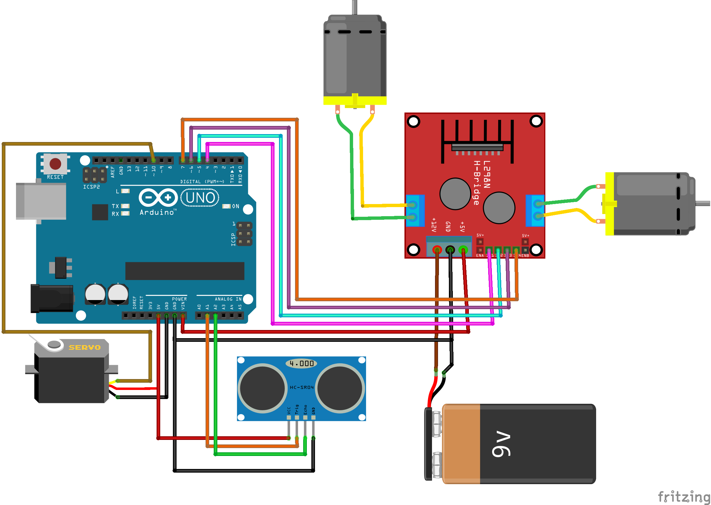

# Session-2: Building an Obstacle Avoiding Robot + Camera Integration

Welcome to Session-2 of the AIoT Workshop! In this session, we’ll be diving into building an obstacle-avoiding robot and integrating a camera for remote viewing. By the end of this session, you'll gain experience in programming autonomous behaviors in robots and capturing video feeds with the ESP32-CAM module.

  

## Objectives

1. **Obstacle Avoiding Robot**: Program an Arduino-based robot to avoid obstacles using the HC-SR04 ultrasonic sensor.
2. **Camera Integration**: Integrate an ESP32-CAM to stream live video, enhancing the robot with remote monitoring capabilities.

## Required Components

- Arduino Uno or compatible board
- HC-SR04 ultrasonic sensor
- Motor driver (L298N or similar)
- DC motors with wheels
- ESP32-CAM module
- Power supply (Battery pack or adapter)
- Connecting wires and breadboard

---

## 1. Part 1: Building the Obstacle Avoiding Robot

### Circuit Diagram

Refer to the circuit diagram below for setting up the obstacle-avoiding robot.

  

### Steps to Follow

1. **Connect the HC-SR04 Ultrasonic Sensor**:
   - **VCC** to Arduino 5V
   - **GND** to Arduino GND
   - **Trig** to Arduino Pin 9
   - **Echo** to Arduino Pin 10

2. **Connect the Motor Driver (L298N)**:
   - Attach DC motors to output pins of the L298N motor driver.
   - **IN1, IN2, IN3, IN4** connected to Arduino digital pins 2, 3, 4, and 5, respectively.

3. **Power the Setup**: Connect an external power supply to the motor driver for motors and power the Arduino either via USB or a battery.

### Code

The Arduino sketch for the obstacle-avoiding robot is available in the following file:
- [ObstacleAvoidingRobot.ino](./obstacle_bot/ObstacleAvoidingRobot/ObstacleAvoidingRobot.ino)

### Uploading the Code

1. Open the `ObstacleAvoidingRobot.ino` file in the Arduino IDE.
2. Select the correct board (Arduino Uno) and port from the **Tools** menu.
3. Upload the code to the Arduino.

### Explanation

This code allows the robot to move forward until an obstacle is detected within a specific distance (set in the code). Once detected, the robot will stop, decide on a new direction (left or right), and continue moving in the new direction to avoid the obstacle.

---

## 2. Part 2: Camera Integration with ESP32-CAM

To enhance the robot’s functionality, we’ll integrate an ESP32-CAM module to provide a live video feed. This will allow remote monitoring of the robot’s environment.

### Circuit Diagram

Refer to the following diagram to set up the ESP32-CAM:

  

### Steps to Follow

1. **ESP32-CAM Connections**:
   - **GND** to Ground
   - **5V** to 5V power source
   - Use an FTDI programmer to upload code and provide power to the ESP32-CAM.

### Code

The ESP32-CAM code is provided in the following files:
- [ESP32CAM_Car.ino](./cam_integration/ESP32CAM_Car/ESP32CAM_Car.ino): Main sketch
- [app_httpd.cpp](./cam_integration/ESP32CAM_Car/app_httpd.cpp): Handles the HTTP server for the video feed
- [camera_index.h](./cam_integration/ESP32CAM_Car/camera_index.h): Provides the HTML interface for the camera

### Uploading the Code

1. Connect the ESP32-CAM to your computer using an FTDI programmer.
2. In the Arduino IDE, select the **ESP32 Wrover Module** board.
3. Adjust the **Upload Speed** to 115200.
4. Open `ESP32CAM_Car.ino`, then upload the code.
5. After the upload, disconnect GPIO 0 from GND, then reset the ESP32-CAM.

### Explanation

This code initializes an HTTP server on the ESP32-CAM, which allows streaming the video feed over Wi-Fi. The IP address of the ESP32-CAM (displayed in the Serial Monitor) can be entered in a browser to view the live feed.

---

## Troubleshooting Tips

1. **Robot Not Moving**: Double-check motor connections and ensure the motor driver is powered properly.
2. **Ultrasonic Sensor Not Detecting Obstacles**: Verify wiring and test the sensor using a simple distance-measurement sketch.
3. **ESP32-CAM Not Streaming**: Ensure you’ve disconnected GPIO 0 from GND after uploading and check your Wi-Fi credentials in the code.

---

## Summary

In this session, you've successfully built an autonomous robot capable of avoiding obstacles and integrated a camera for remote video streaming. These skills are crucial in building IoT applications with AI capabilities, setting the stage for more complex projects.
