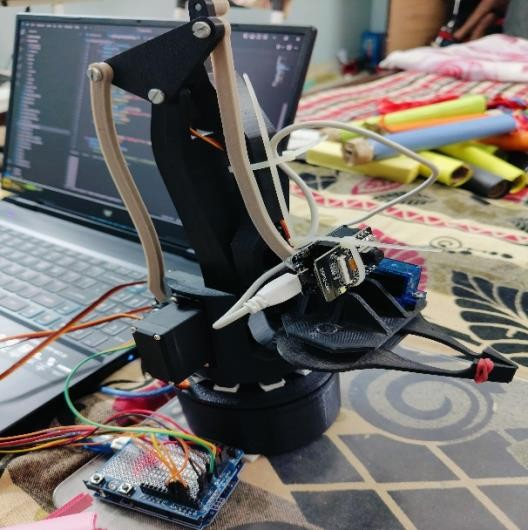
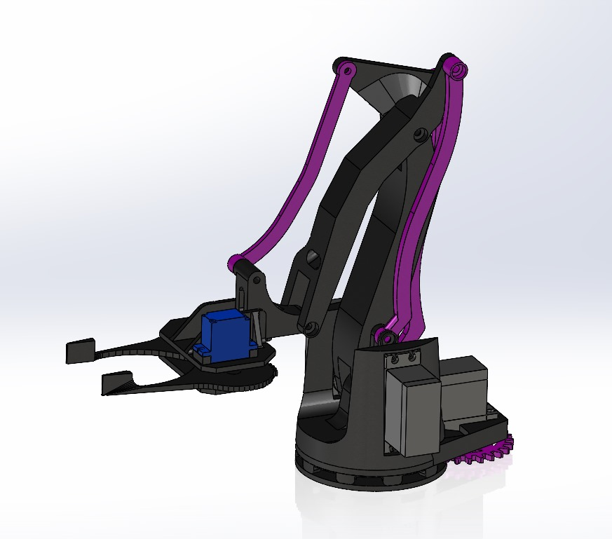

# Color Tracking Robotic Gripper

## Description
The **Color Tracking Robotic Gripper** is an automated system designed to identify and sort objects based on their color. Equipped with computer vision capabilities, this robotic arm can distinguish between two color categories, sorting objects to either the left or right. This functionality is particularly useful in scenarios where sorting of hazardous materials is necessary, reducing human health risks. The system integrates Python, OpenCV, Arduino, and ESP32-CAM for reliable and efficient color-specific object handling in both industrial and domestic applications.

**Note:** This project was selected as the top project in the IoTics AIoT Workshop and was also exhibited in the IoT Exhibition of the *Introduction to IoT, ECL 104* course, guided by Dr. Rashmi Ranjan Kumar.

## Features
- **Automatic Color Detection and Sorting**: Detects objects based on specified color ranges and sorts them accordingly.
- **Dual-Sided Sorting**: Places items on the left or right based on color.
- **Applications in Hazardous Material Sorting**: Minimizes human interaction with potentially harmful materials.
- **ESP32-CAM and Arduino Integration**: Uses an ESP32-CAM for real-time color detection and an Arduino to control the robotic arm's movements.
- **3D Printed Components**: The arm’s structure is custom-designed and 3D-printed for modular assembly and robustness.

## Demo Video
Check out the project in action: [Demo Video](https://drive.google.com/file/d/10mPuvANaVOIOEYqjE63bNqFpUy-5URYO/view?usp=sharing)

<p align="center">
  
</p>

## Installation and Setup

1. **Clone the Repository**:
    ```sh
    git clone https://github.com/your-username/color-tracking-robotic-gripper.git
    cd color-tracking-robotic-gripper
    ```

2. **Install Required Libraries**:
    ```sh
    pip install opencv-python pyserial numpy
    ```

3. **Upload Arduino Code**:
    - Use the Arduino IDE to upload the provided sketch to the Arduino Uno.

## Hardware Requirements
- **3 MG995 Servomotors**: For shoulder, elbow, and wrist movements.
- **1 SG90 Servo**: For gripper control.
- **ESP32-CAM**: For real-time image capturing.
- **Arduino Uno**: Microcontroller to coordinate servos based on color detection.
- **3D-Printed Robotic Arm**: Includes STL and STEP files.
- **Programming Board for ESP32-CAM**: To connect ESP32-CAM to your computer.
- **Laptop**: For running the Python script and image processing.

### Included Files
- **CAD Models**:
  - *RA-2.0 MK2 (Test Assembly)*: Provided in both STL and STEP formats.
    
- **ESP32-CAM Code**: Located in the `CameraWebServer` folder.
- **Python Code**:
  - `colortrackingtuner.py`: Script for calibrating color detection.
  - `iotProjectUpgraded.py`: Main script for color tracking and robotic arm control.
- **Images for Reference**:
  - `final_setup.png`: Displays the assembled system setup.
  - `gripper_stl.jpg`: Shows the 3D model of the gripper.
  - `flowchart.jpg`: System flowchart for process overview.
- **Sample Video**:
  - `demo.mp4`: Demonstrates the robotic arm in operation.

## Usage

1. **Set Up ESP32-CAM**:
   - Power on and connect the ESP32-CAM to your computer using the programming board.
   - Flash the provided ESP32-CAM code to set up the local web server.
   - Open the Arduino serial monitor to obtain the IP address of the ESP32-CAM.

2. **Run Python Script**:
   - Edit `iotProjectUpgraded.py` to update the IP address for the ESP32-CAM.
   - Start the Python script in a compatible IDE (e.g., VS Code) to capture video frames.
   - The script processes the frames to detect objects based on color and commands the Arduino to move the robotic arm.

3. **Sorting Operation**:
   - Ensure all connections are secure and power on the Arduino.
   - Place objects in view of the ESP32-CAM. The robotic arm will automatically sort items to the left or right based on color.

## Procedure Outline

- **Vision Processing**: 
  - The ESP32-CAM captures real-time video and streams it to the Python program.
  - The Python script applies color filtering (using HSV color space) to detect and locate objects.
  
- **Robotic Arm Control**:
  - Detected color and position data are sent to the Arduino, which moves the servos to align the arm with the object and perform grasping and placement actions.

- **System Flowchart**:
  - Refer to `flowchart.jpg` for a visual overview of the sorting process.

## Team Details

### Team Name
IoT-1st-Year

### Members
- **[Jayesh Thakare](https://github.com/Yorha-7)**: Programming and Design - +91 8446374356
- **Kartik Agrawal**: Demonstrator - +91 9259322930
- **Nimesh Suryawanshi**: Assembly - +91 7489230310
- **Vivek Kumar**: Hardware Management - +91 6393265832

**Email**: [Jayesh Thakare](mailto:scientistn1420@gmail.com)

## Acknowledgments
- Thanks to the open-source community for resources and libraries.
- Special thanks to Jayesh for conceiving and leading the project’s implementation. 
- Heartfelt thanks to the IoTics club team for providing such a valuable learning opportunity and fostering a supportive community.
